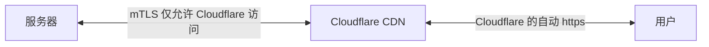
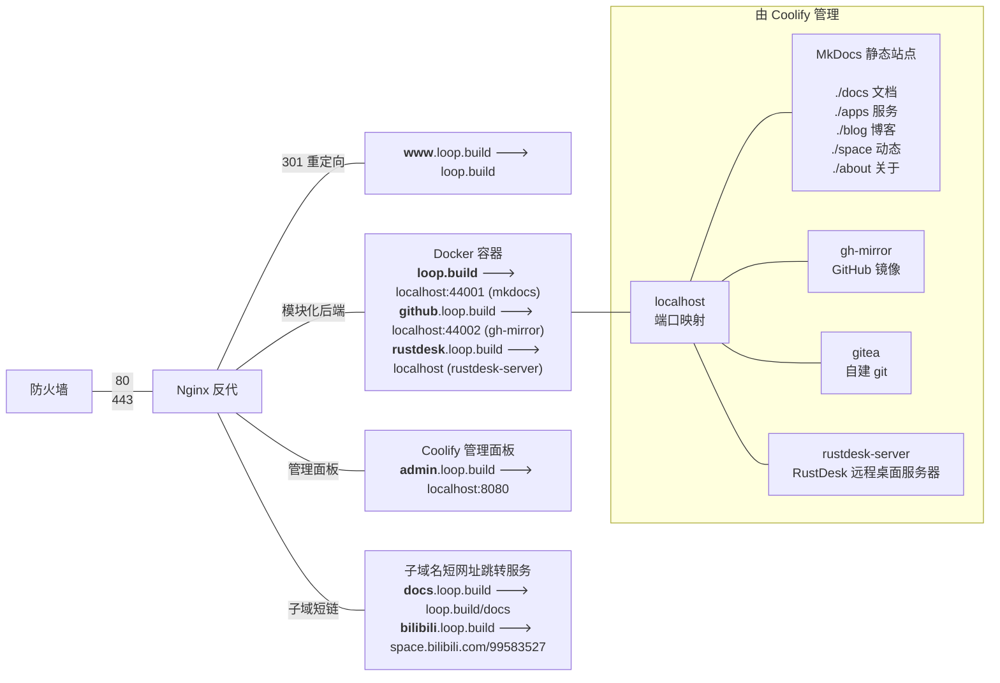

# 服务器技术栈

## 结构图

```mermaid
flowchart LR
    server[服务器] <---->|mTLS 仅允许 Cloudflare 访问| cloudflare[Cloudflare CDN]
    cloudflare <---->|Cloudflare 的自动 https| user[用户]
```

**图1** 外部结构

```mermaid
flowchart LR
    firewall[防火墙]
    nginx[Nginx 反代]
    nginx_redirect[<b>www</b>.loop.build 🡒 loop.build]
    docker["Docker 容器\n<b>loop.build</b> 🡒 localhost:44001 (mkdocs)\n<b>github</b>.loop.build 🡒 localhost:44002 (gh-mirror)\n<b>rustdesk</b>.loop.build 🡒 localhost (rustdesk-server)"]
    subgraph docker-compo[由 Coolify 管理]
        direction LR
        port[localhost\n端口映射]
        port --- mkdocs[MkDocs 静态站点\n\n./docs 文档\n./apps 服务\n./blog 博客\n./space 动态\n./about 关于]
        port --- gh-mirror[gh-mirror\nGitHub 镜像]
        port --- gitea[gitea\n自建 git]
        port --- rustdesk-server[rustdesk-server\nRustDesk 远程桌面服务器]
    end
    coolify[Coolify 管理面板\n<b>admin</b>.loop.build 🡒 localhost:8080]
    redirector[子域名短网址跳转服务\n<b>docs</b>.loop.build 🡒 loop.build/docs\n<b>bilibili</b>.loop.build 🡒 space.bilibili.com/99583527]

    firewall ---|80<br>443| nginx
    nginx ---|301 重定向| nginx_redirect
    nginx ---|模块化后端| docker
    docker --- port
    nginx ---|管理面板| coolify
    nginx ---|子域短链| redirector
```

**图2** 内部结构

