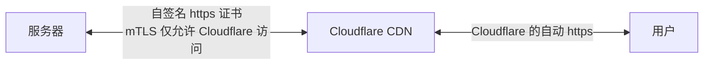
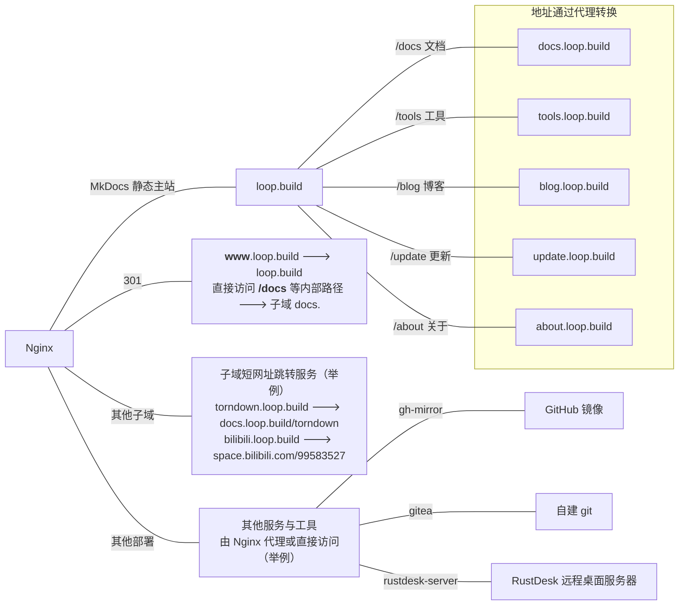

# 基于 Cloudflare 的服务器结构
日期：2024-04-21
 ---
## 结构图

**图1** 外部结构

**图2** 内部结构

<!-- 服务器 <==自签名证书https+mTLS仅限CF访问==> Cloudflare CDN <==CF自动https==> 用户
    |
  nginx
    |- loop.build 主站（MkDocs静态，自动拉取github并编译）
    |- www.loop.build 301到主站
    |- docs.loop.build 文档（各项目说明）
    |- tools.loop.build 工具（服务器上部署的工具之类）
    |- blog.loop.build 博客
    |- update.loop.build 动态
    |- about.loop.build 关于页
    |   这五个内容站，内部实际上直接代理到loop.build/subdomain/*
    |   但是如果直接访问/subdomain，会被301到subdomain.loop.build
    |
    |- flask写的跳转器
    |       |- （举例）powertoys.loop.build -> docs.loop.build/powertoys
    |       |- （举例）among.loop.build -> docs.loop.build/among-python
    |
    | 其他部署（最好是docker）
    |- gh-mirror 镜像GitHub
    |- gitea 自建git
    ... -->
