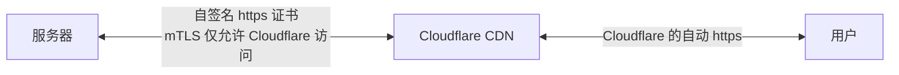
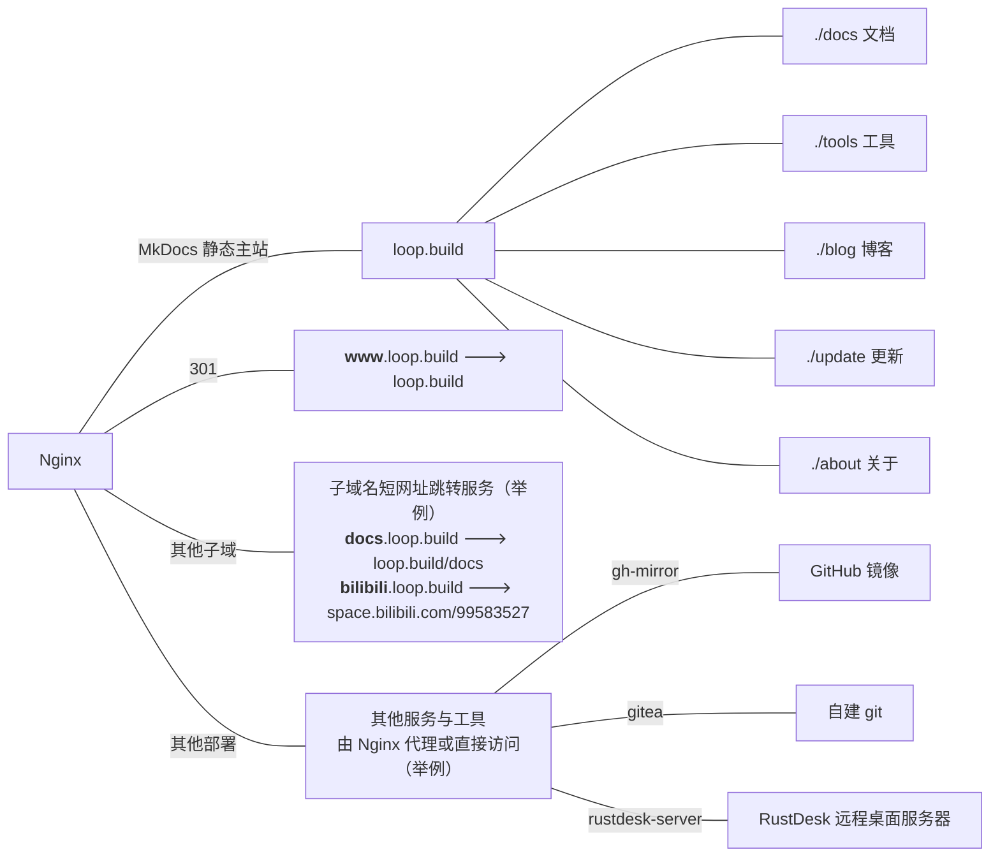

# 服务器技术栈
日期：2024-04-21
 ---
## 结构图

```mermaid
flowchart LR
    server[服务器] <---->|自签名 https 证书\nmTLS 仅允许 Cloudflare 访问| cloudflare[Cloudflare CDN]
    cloudflare <---->|Cloudflare 的自动 https| user[用户]
```

**图1** 外部结构

```mermaid
flowchart LR
    nginx[Nginx]
    loop_main[loop.build]
    nginx_redirect[<b>www</b>.loop.build 🡒 loop.build]
    docs[./docs 文档]
    tools[./tools 工具]
    blog[./blog 博客]
    update[./update 更新]
    about[./about 关于]
    redirector[子域名短网址跳转服务（举例）\n<b>docs</b>.loop.build 🡒 loop.build/docs\n<b>bilibili</b>.loop.build 🡒 space.bilibili.com/99583527]
    other_tools[其他服务与工具\n由 Nginx 代理或直接访问\n（举例）]
    gh-mirror[GitHub 镜像]
    gitea[自建 git]
    rustdesk-server[RustDesk 远程桌面服务器]

    nginx ---|MkDocs 静态主站| loop_main
    nginx ---|301| nginx_redirect
    loop_main --- docs
    loop_main --- tools
    loop_main --- blog
    loop_main --- update
    loop_main --- about
    nginx ---|其他子域| redirector
    nginx ---|其他部署| other_tools
    other_tools ---|gh-mirror| gh-mirror
    other_tools ---|gitea| gitea
    other_tools ---|rustdesk-server| rustdesk-server
```

**图2** 内部结构

<!--!!! 下一步：修改服务器架构，为保证单页面应用的体验，不再区分 docs 等子站，直接访问子站会跳转到主站 -->
